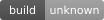
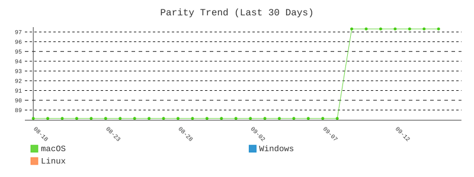
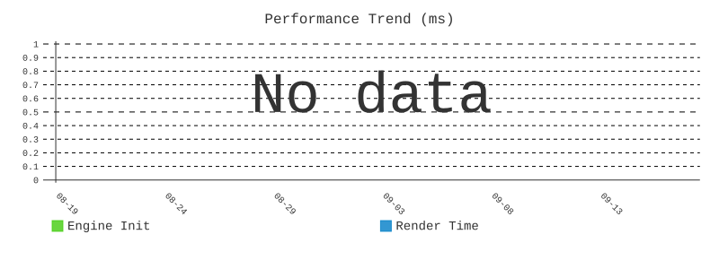
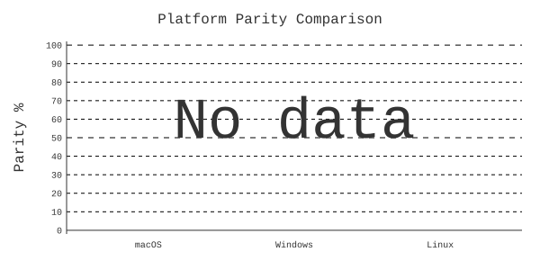

<p align="center">
  
</p>

<h1 align="center">HiWave</h1>

<p align="center">
  <strong>Focus. Flow. Freedom.</strong><br>
  A privacy-first browser built from scratch in Rust — designed to help you browse less, not more.
</p>

<p align="center">
  <a href="#platform-status">Status</a> •
  <a href="#what-is-hiwave">What is HiWave?</a> •
  <a href="#downloads">Downloads</a> •
  <a href="#platforms">Platforms</a> •
  <a href="#quick-start">Quick Start</a> •
  <a href="#contributing">Contributing</a> •
  <a href="#support-the-project">Support</a>
</p>

<p align="center">
  
  
  
</p>

<p align="center">
  <a href="https://github.com/hiwavebrowser/hiwave/actions/workflows/parity-unified.yml">
    
  </a>
</p>

<p align="center">
  
  
</p>

---

## Platform Status

| Platform | Build | Parity | Tests | Performance |
|----------|-------|--------|-------|-------------|
| macOS |  |  |  |  |
| Windows |  |  |  |  |
| Linux |  |  |  |  |

**Reading this table honestly:** the three platforms measure different things
today. macOS numbers are visual-parity cases (pixel comparison against Chrome);
Windows and Linux numbers are `cargo test` results from each platform's CI. A
"no data" parity badge means parity has genuinely never been captured on that
platform — it is not inferred from anything else, and a passing build is never
evidence of pixel fidelity. Details in
[How these numbers are produced](#how-these-numbers-are-produced).

**Per-platform engine status** (what actually renders, what is parsed-but-inert,
known gaps): see each platform README —
[Windows](./hiwave-windows#readme) · [macOS](./hiwave-macos#readme) ·
[Linux](./hiwave-linux#readme).

<details>
<summary>Parity Trend (click to expand)</summary>



</details>

<details>
<summary>Performance Trend</summary>



</details>

<details>
<summary>Platform Comparison</summary>



</details>

<details>
<summary>Code Churn Analysis</summary>

View the interactive [**Churn Report Dashboard**](churn-reports/dashboard.html) to see:
- File modification frequency across all platforms
- Line range hotspots indicating areas of active development
- Cross-platform file synchronization patterns
- Divergent development patterns

*Updated weekly via GitHub Actions*

</details>

---

## Visual Parity Testing

RustKit engine is tested against Chrome 120 baselines using **triple verification**:

| Verification | Description | Weight |
|--------------|-------------|--------|
| **Pixel Diff** | Direct pixel comparison | Primary |
| **Layout Rects** | Element positioning accuracy | Secondary |
| **Computed Styles** | CSS property matching | Diagnostic |

### Platform Support

| Platform | Parity capture | Build + unit tests |
|----------|----------------|--------------------|
| macOS | Active — full headless parity testing | Not yet published to the metrics feed |
| Windows | Pending — awaiting headless rendering port | Published from CI (`metrics-history` branch) |
| Linux | Pending — awaiting headless rendering port | Published from CI (`metrics-history` branch) |

Windows and Linux run hundreds of `cargo test` engine tests in CI on every
master merge; those are real and drive the Build/Tests badges above. What they
do **not** yet have is pixel capture, so their parity badges stay "no data"
rather than borrowing a number from anywhere else.

### Test Cases (26 total)

| Category | Count | Cases |
|----------|-------|-------|
| Built-ins | 5 | `new_tab`, `about`, `settings`, `chrome_rustkit`, `shelf` |
| Websuite | 8 | `article-typography`, `card-grid`, `css-selectors`, `flex-positioning`, `form-elements`, `gradient-backgrounds`, `image-gallery`, `sticky-scroll` |
| Micro-tests | 13 | `backgrounds`, `bg-pure`, `bg-solid`, `combinators`, `form-controls`, `gpu-gradient-regression`, `gradient-no-radius`, `gradient-radius-only`, `gradients`, `images-intrinsic`, `pseudo-classes`, `rounded-corners`, `specificity` |

The case list above is taken from the harness's own results file, not
maintained by hand — if it drifts from `parity_test_results.json`, the results
file wins.

### Running Parity Tests

```bash
# Run all tests with 3 iterations (macOS - fully supported)
cd hiwave-macos
python3 scripts/parity_swarm.py --scope all --iterations 3

# Windows/Linux parity tests require parity-capture binary
# which is currently only available on macOS.
# Scripts exist but will fail until headless support is ported.

# Run with Xvfb (Linux - once headless support is ported)
cd hiwave-linux
xvfb-run python3 scripts/parity_swarm.py --scope all
```

*Parity scores updated daily via [GitHub Actions](https://github.com/hiwavebrowser/hiwave/actions/workflows/parity-unified.yml)*

---

## How these numbers are produced

Every number on this page has a path back to a machine that measured it. If a
number has no such path, it does not get published — "no data" is a valid and
honest state.

| Number | Producer | Where it lives | Consumer |
|--------|----------|----------------|----------|
| macOS parity % | Headless pixel capture vs Chrome baselines (`parity_swarm.py`) | `hiwave-macos` parity artefacts | [`collect_metrics.py`](scripts/collect_metrics.py) |
| Windows build + tests | Windows CI on master merges | [`hiwave-windows@metrics-history`](https://github.com/hiwavebrowser/hiwave-windows/tree/metrics-history) (`metrics/history.csv`, append-only) | same |
| Linux build + tests | Linux CI on master merges | [`hiwave-linux@metrics-history`](https://github.com/hiwavebrowser/hiwave-linux/tree/metrics-history) (`metrics/history.csv`, append-only) | same |
| Badges | [`generate_badges.py`](scripts/generate_badges.py) from `metrics/unified.json` | [`badges/`](badges/) | this README |

The aggregation runs in [`metrics.yml`](.github/workflows/metrics.yml) (daily,
and on dispatch from the platform repos). Rules the pipeline enforces rather
than trusts anyone to remember:

- **Numbers fail closed.** If a feed is unreachable, the platform publishes
  NOT-MEASURED. Nothing is hand-filled, estimated, or carried forward as if
  fresh.
- **Only `master` rows drive public numbers.** A newer measurement from a PR
  branch never wins.
- **Build status is read, never inferred.** A parity number existing is not
  evidence the build passes, and vice versa.
- **Measurements carry their own commit and timestamp.** A number older than
  its badge admits it (`… · Nd stale`) instead of posing as current.
- **Different test ontologies never share a denominator.** macOS parity cases
  and Windows/Linux cargo tests are counted separately, and the overall badge
  names its source when both exist.

---

## What is HiWave?

**HiWave** is a new kind of browser — one that respects your attention and privacy.

While most browsers are designed to keep you scrolling endlessly, HiWave actively helps you:
- 🧹 **Close tabs** with The Shelf — park tabs that fade with age
- 🛡️ **Block trackers** at the engine level — no extensions needed
- 🗃️ **Separate contexts** with Workspaces — work stays work, personal stays personal
- ⌨️ **Navigate fast** with keyboard-first design

### Built Different

Unlike Chrome, Firefox, or Safari, **HiWave runs on RustKit** — our own browser engine written from scratch in Rust. Everything is fully built in Rust.

⚠️ **RustKit Development Status**: RustKit is actively under development and may contain rendering bugs and visual inconsistencies. For the most stable experience, use the WebView/WebKit variants which rely on system rendering engines. RustKit variants are recommended for testing and development purposes.

---

## Downloads

Pre-built binaries are available for all platforms with multiple rendering backend options:

### 📦 [Latest Nightly Build](https://github.com/hiwavebrowser/hiwave/releases/tag/nightly) (Automated Daily)
### 📦 [Latest Weekly Release](https://github.com/hiwavebrowser/hiwave/releases/latest) (Stable)

### Build Variants

Each platform offers multiple build variants with different rendering backends:

#### 🪟 Windows
- **`hiwave-windows-rustkit`** — RustKit hybrid mode (RustKit for content, WebView2 for UI) ⚠️ *In Development*
- **`hiwave-windows-webview2`** — WebView2 fallback (uses Edge Chromium for all rendering) ✅ *Stable*
- **`hiwave-windows-native-win32`** — 100% RustKit native Win32 (experimental) 🚧 *Experimental*

#### 🍎 macOS
- **`hiwave-macos-rustkit`** — RustKit hybrid mode (RustKit for content, WebKit for UI) ⚠️ *In Development*
- **`hiwave-macos-webkit`** — WebKit fallback (uses system WebKit for all rendering) ✅ *Stable*

#### 🐧 Linux
- **`hiwave-linux-webview`** — GTK WebKit2 (uses system WebKit for all rendering) ✅ *Stable*
- **`hiwave-linux-rustkit`** — RustKit hybrid mode (experimental) 🚧 *Experimental*
- **`hiwave-linux-native-linux`** — 100% RustKit native (experimental) 🚧 *Experimental*

**Recommendation**: For daily use, choose the **WebView2/WebKit variants** for maximum stability. RustKit variants are for testing and development as the engine continues to mature.

### Installation & Usage Instructions

#### 🪟 Windows

1. **Download** the desired `.zip` file from the releases page
2. **Extract** the zip file to a location of your choice (e.g., `C:\Program Files\HiWave\`)
3. **Run** `hiwave.exe`

**Security Warning (First Launch):**
- Windows will likely show a "Windows protected your PC" SmartScreen warning because the binary is not signed with a code signing certificate
- Click **"More info"** → **"Run anyway"** to proceed
- This warning appears only on first launch

**Alternative:** Right-click `hiwave.exe` → **Properties** → **Unblock** checkbox → **Apply** → **OK** (before first run)

**Note:** The `webview2` variant requires Microsoft Edge WebView2 Runtime. Windows 11 includes this by default. For Windows 10, it will be installed automatically on first run if missing.

#### 🍎 macOS

1. **Download** the desired `.zip` file from the releases page
2. **Extract** the zip file (double-click in Finder)
3. **Move** `hiwave.app` (if applicable) to your Applications folder, or run the binary directly

**Security Warning (Required for Unsigned Apps):**
- macOS Gatekeeper will block unsigned applications
- When you first try to open HiWave, you'll see **"HiWave cannot be opened because it is from an unidentified developer"**

**To allow HiWave to run:**

**Option 1 (Recommended):**
1. Open **System Settings** → **Privacy & Security**
2. Scroll down to the **Security** section
3. You should see a message about HiWave being blocked with an **"Open Anyway"** button
4. Click **"Open Anyway"** and confirm with your password

**Option 2 (Command Line):**
```bash
# Remove quarantine attribute
xattr -dr com.apple.quarantine /path/to/hiwave

# Or for the app bundle
xattr -dr com.apple.quarantine /Applications/HiWave.app
```

**Option 3 (Control-Click):**
1. Hold **Control** and click the HiWave application
2. Select **"Open"** from the context menu
3. Click **"Open"** in the confirmation dialog

⚠️ **Note:** These security warnings appear because HiWave is not currently code-signed with an Apple Developer certificate. This is standard for open-source projects distributed as pre-built binaries.

#### 🐧 Linux

1. **Download** the desired `.zip` file from the releases page
2. **Extract** the zip file:
   ```bash
   unzip hiwave-linux-*.zip
   ```
3. **Make executable** (if needed):
   ```bash
   chmod +x hiwave
   ```
4. **Run**:
   ```bash
   ./hiwave
   ```

**Dependencies:**
- The `webview` variant requires GTK 3, WebKit2GTK 4.1, and related libraries
- Install on Ubuntu/Debian:
  ```bash
  sudo apt-get install libgtk-3-0 libwebkit2gtk-4.1-0 libayatana-appindicator3-1
  ```
- Install on Fedora:
  ```bash
  sudo dnf install gtk3 webkit2gtk4.1
  ```
- Install on Arch:
  ```bash
  sudo pacman -S gtk3 webkit2gtk
  ```

**AppImage (Coming Soon):** We plan to provide AppImage builds that bundle all dependencies for easier distribution.

---

## Platforms

This repository is the umbrella project containing all HiWave components:

| Platform | Repository | Status |
|----------|------------|--------|
| 🪟 **Windows** | [hiwave-windows](./hiwave-windows) | Alpha — RustKit engine |
| 🍎 **macOS** | [hiwave-macos](./hiwave-macos) | Alpha — RustKit engine |
| 🐧 **Linux** | [hiwave-linux](./hiwave-linux) | Alpha — RustKit engine |

Each platform directory contains its own README with platform-specific build instructions.

---

## Quick Start

### Option 1: Download Pre-built Binary (Recommended)

Download the latest release for your platform from the [Downloads](#downloads) section above. Choose a stable variant (WebView2/WebKit) for daily use.

### Option 2: Build from Source

#### Clone with Submodules

```bash
git clone --recursive https://github.com/hiwavebrowser/hiwave.git
cd hiwave
```

#### Windows
```powershell
cd hiwave-windows

# Build variants:
cargo build --release --no-default-features --features rustkit          # RustKit hybrid
cargo build --release --no-default-features --features webview-fallback # WebView2 (stable)
cargo build --release --no-default-features --features native-win32     # Native Win32
```

#### macOS
```bash
cd hiwave-macos

# Build variants:
cargo build --release --features rustkit                  # RustKit hybrid
cargo build --release --no-default-features --features webview-fallback # WebKit (stable)
```

#### Linux
```bash
cd hiwave-linux

# Build variants:
cargo build --release --features webview-fallback              # GTK WebKit (stable)
cargo build --release --no-default-features --features rustkit # RustKit hybrid
cargo build --release --no-default-features --features native-linux # Native
```

See each platform's README for detailed build instructions and development setup.

---

## Contributing

**We'd love your help!** HiWave is an ambitious project and there's plenty to do.

### 🐛 Found a Bug?

[**Open an Issue**](https://github.com/hiwavebrowser/hiwave/issues/new?labels=bug) — Tell us what went wrong. Include:
- What you expected vs. what happened
- Steps to reproduce
- Your OS and HiWave version

### 💡 Have an Idea?

[**Submit a Feature Request**](https://github.com/hiwavebrowser/hiwave/issues/new?labels=enhancement) — We want to hear it! Great ideas come from users.

### 🔧 Want to Code?

1. Fork the repo
2. Check the issues labeled [`good first issue`](https://github.com/hiwavebrowser/hiwave/issues?q=is%3Aissue+is%3Aopen+label%3A%22good+first+issue%22)
3. Submit a PR!

See [CONTRIBUTING.md](./hiwave-windows/CONTRIBUTING.md) for development setup and guidelines.

### 📖 Improve the Docs

Documentation PRs are always welcome. If something confused you, it probably confuses others too.

---

## Support the Project

<p align="center">
  <a href="https://ko-fi.com/hiwavebrowser">
    
  </a>
</p>

**HiWave is free, open source, and ad-free.** We don't track you. We don't sell your data. We never will.

Building a browser from scratch is a massive undertaking. If HiWave helps you focus better or just makes you smile, consider buying us a coffee:

<p align="center">
  <strong>☕ <a href="https://ko-fi.com/hiwavebrowser">ko-fi.com/hiwavebrowser</a></strong>
</p>

Your support helps cover:
- ⏰ Development time (a LOT of it)
- 🖥️ Infrastructure and testing
- 🚀 Future features like HiWave Sync

Every coffee counts. Thank you! 💜

---

## Project Structure

```
hiwave/
├── hiwave-windows/     # Windows app (RustKit engine)
├── hiwave-macos/       # macOS app (RustKit engine)
├── hiwave-linux/       # Linux app (RustKit engine)
├── churn-report/       # Code churn analysis tool (submodule)
├── churn-reports/      # Generated churn analysis reports
├── community/          # Ways to help and collaborate
└── README.md           # You are here
```

---

## License

HiWave is licensed under the [Mozilla Public License 2.0](./hiwave-windows/LICENSE).

- ✅ Free to use, modify, and distribute
- ✅ Build commercial products
- ⚠️ Changes to HiWave's files must be shared under MPL-2.0

For commercial licensing options, see [COMMERCIAL-LICENSE.md](./hiwave-windows/COMMERCIAL-LICENSE.md).

---

<p align="center">
  <strong>Built with 💜 for people who want to focus.</strong>
</p>

<p align="center">
  <a href="https://www.hiwavebrowser.com">Website</a> •
  <a href="https://github.com/hiwavebrowser/hiwave/issues">Issues</a> •
  <a href="https://ko-fi.com/hiwavebrowser">Support Us</a> •
  <a href="https://twitter.com/hiwavebrowser">Twitter</a>
</p>

